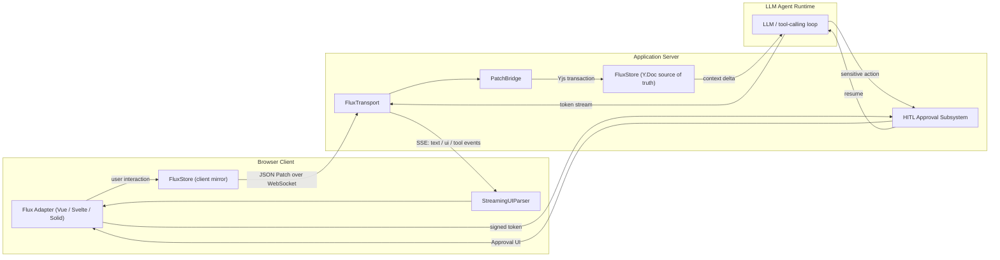
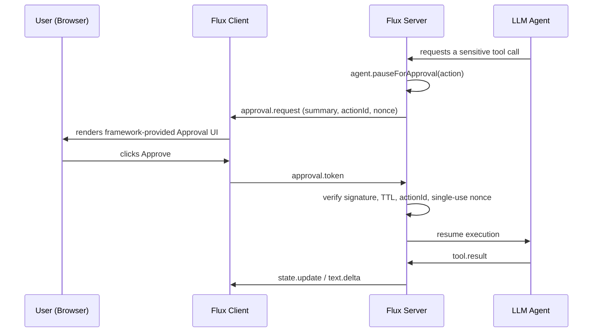

# Flux — System Architecture

**Project:** Flux
**Status:** Ideation / Pre-Alpha
**Document version:** 0.1 (Draft)
**Last updated:** August 24, 2026
**Related documents:** PRD.md · TRD.md · PHASES.md · RULES.md · IMPLEMENTATION.md · GUIDE.md

---

## 1. High-Level Overview

Three runtimes cooperate: the **browser client**, the **application server**, and the **LLM agent runtime** (which may live inside the same server process or be a separate service). Flux's core library runs on both client and server; only the server-side half owns the authoritative state and the HITL gate.



## 2. Monorepo & Package Layout

```
@flux/core         Vanilla TS: transport, state engine, renderer, HITL
@flux/vue          Vue 3 composables wrapping @flux/core
@flux/svelte       Svelte stores wrapping @flux/core
@flux/solid        Solid primitives wrapping @flux/core
@flux/cli          create-flux-app scaffolding + Vite/Rollup plugins
@flux/conformance-tests   Shared behavioral test suite run against every adapter
```

Dependency direction is one-way: adapters depend on core; core never depends on an adapter or on the CLI. See RULES.md §3 for the enforced boundary rules.

## 3. Core Components

**FluxTransport** — owns the SSE connection (agent→client) and WebSocket connection (client→agent), demultiplexes `FluxEnvelope`s by `type`, and exposes reconnect/resync. Full protocol spec: TRD §4.1.

**FluxStore + PatchBridge** — `FluxStore` wraps a Yjs `Y.Doc`. On the server it is the authoritative copy; on the client it is a mirror kept in sync via Yjs updates. `PatchBridge` is the one and only path by which a JSON Patch op is allowed to mutate a `Y.Doc` (RULES.md §1.1). Full protocol spec: TRD §4.2.

**StreamingUIParser / FluxRenderer** — consumes `ui.schema.delta` events, incrementally repairs and parses them, validates against partial/full component schemas, sanitizes rich-text props, and emits prop updates to mounted components. Full spec: TRD §4.3.

**HITL Approval Subsystem** — implements `agent.pauseForApproval()`, issues and verifies single-use signed tokens, and renders the (framework-provided, LLM-untouchable) Approval UI. Full spec: TRD §4.4.

**Framework Adapters** — thin reactive wrappers: a Vue composable (`useFluxAgent`), a Svelte store (`fluxAgent`), and a Solid primitive (`createFluxAgent`), each translating core events into that framework's native reactivity primitives (refs, stores, signals) without re-implementing any core logic.

**CLI** — `npm create flux@latest`, scaffolds a working app from a template per framework, wires the Vite/Rollup plugin, and gets a developer to the time-to-hello-world target (PRD §9) in under 2 minutes.

## 4. Data Flow Walkthroughs

### 4.1 Streaming generative UI render

1. Agent begins emitting a UI schema; server relays tokens as `ui.schema.delta` envelopes over SSE.
2. Client `StreamingUIParser` buffers, repairs, and incrementally parses the payload.
3. Once the structural discriminant (`component`) is valid, the target component mounts.
4. As further props stream in and pass partial-schema validation, they're diffed and pushed into the mounted component.
5. Any rich-text prop is sanitized before being handed to the adapter.

### 4.2 Client-driven state mutation round trip

1. User interacts with a rendered component (e.g., edits a field).
2. The adapter produces a JSON Patch op describing the change and sends it as a `state.patch` envelope over the WebSocket.
3. Server's `PatchBridge` translates the op into a Yjs mutation inside a transaction against the authoritative `Y.Doc`.
4. Yjs resolves convergence if a concurrent edit exists; an update is emitted.
5. The update is rebroadcast to other clients as `state.update`, and a compact diff is derived and injected into the agent's next context turn.

### 4.3 HITL approval flow



## 5. Extension Model

New framework adapters implement a small required interface (connect to core's event bus, expose reactive bindings, mount the renderer's output using that framework's primitives) and must pass `@flux/conformance-tests` before being considered "supported." This keeps the core/adapter boundary enforceable rather than aspirational.

## 6. Deployment Topology

- **Client:** ships as a standard ES module bundle; no server-side rendering requirement, though SSR-compatible usage is a Phase 4 consideration for the Vue/Svelte adapters (both ecosystems commonly SSR).
- **Server:** Node.js runtime assumed for v1 (WebSocket + SSE + Yjs all have mature Node support); edge-runtime compatibility (no persistent WebSocket support on most edge platforms) is an explicit non-goal for v1 and a candidate for a future transport fallback (e.g., WebSocket-only edge functions with polling fallback).
- **Agent runtime:** may be co-located with the application server or a separate service reachable over an internal RPC — Flux only requires that *something* calls into `FluxTransport`'s server-side API and `agent.pauseForApproval()`.

## 7. Failure Modes & Resilience

| Failure | Behavior |
|---|---|
| WebSocket drops mid-mutation | Client buffers unsent patches locally and flushes on reconnect, in order, after a successful state resync. |
| SSE stream drops mid-schema-stream | Renderer marks the in-flight component "stalled" after a timeout and either resumes cleanly (if `Last-Event-ID` resume succeeds) or falls back to an error component. |
| Server restarts with a pending approval | Pending-approval state is persisted (not memory-only, per TRD §4.4), so a restart doesn't silently auto-deny or auto-approve. |
| Malformed/unrepairable JSON from the LLM | Parser gives up after a bounded number of repair attempts and emits an error event rather than looping indefinitely. |
