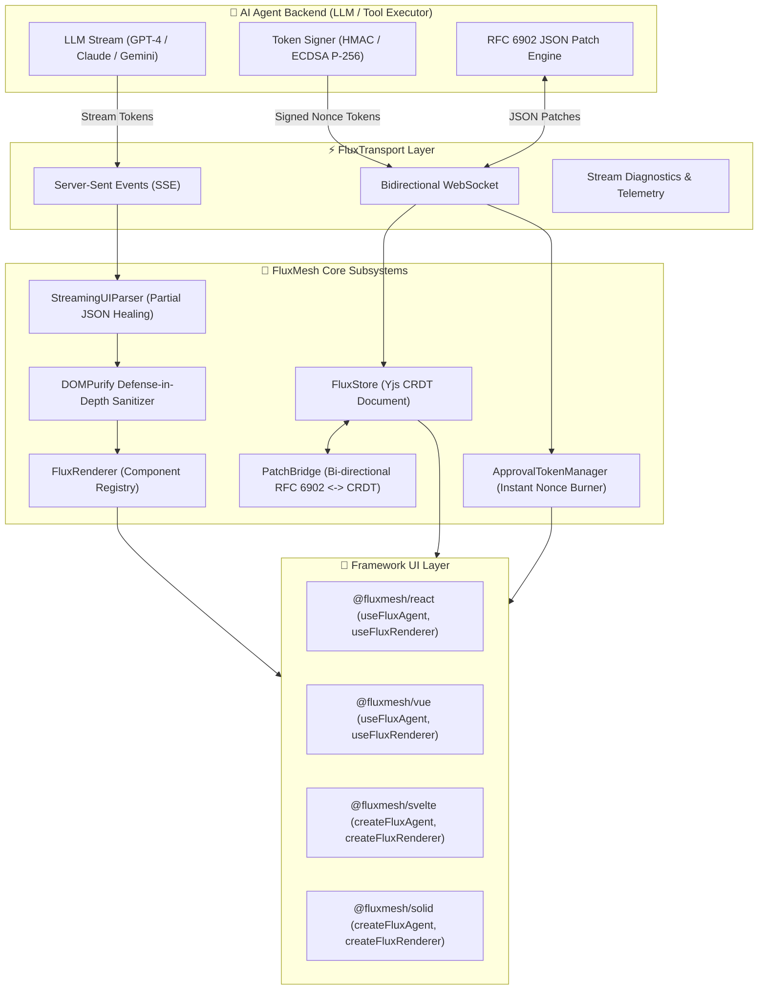

# FluxMesh: The Framework-Agnostic Agentic AI Web Engine
### Complete Technical Documentation, Architecture Guide & API Reference

[](https://opensource.org/licenses/MIT)
[](https://www.npmjs.com/package/@fluxmesh/core)
[]()

FluxMesh (`@fluxmesh/*`) is a high-performance, framework-agnostic TypeScript library engineered specifically for building **Agentic AI-Native Web Applications**. It bridges the gap between autonomous AI agents and modern frontend user interfaces.

---

## 📑 Table of Contents

1. [Executive Summary & The 4 Hard Problems](#1-executive-summary--the-4-hard-problems)
2. [System Architecture & Data Flow](#2-system-architecture--data-flow)
3. [Quick Start in Under 2 Minutes](#3-quick-start-in-under-2-minutes)
4. [Deep Dive into the 4 Core Pillars](#4-deep-dive-into-the-4-core-pillars)
   - [Pillar 1: Resilient Bidirectional Transport Layer](#pillar-1-resilient-bidirectional-transport-layer)
   - [Pillar 2: Three-Way State Synchronization (CRDT + JSON Patch)](#pillar-2-three-way-state-synchronization-crdt--json-patch)
   - [Pillar 3: Streaming Generative UI & Defense-in-Depth Sanitization](#pillar-3-streaming-generative-ui--defense-in-depth-sanitization)
   - [Pillar 4: Cryptographically Enforced Human-In-The-Loop (HITL v1 & v2)](#pillar-4-cryptographically-enforced-human-in-the-loop-hitl-v1--v2)
5. [Framework Adapters & Step-by-Step UI Integration](#5-framework-adapters--step-by-step-ui-integration)
   - [React (`@fluxmesh/react`)](#react-fluxmeshreact)
   - [Vue 3 (`@fluxmesh/vue`)](#vue-3-fluxmeshvue)
   - [Svelte (`@fluxmesh/svelte`)](#svelte-fluxmeshsvelte)
   - [SolidJS (`@fluxmesh/solid`)](#solidjs-fluxmeshsolid)
   - [Vanilla TypeScript (`@fluxmesh/core`)](#vanilla-typescript-fluxmeshcore)
6. [Backend Integration Guide (Express, FastAPI, Next.js)](#6-backend-integration-guide)
7. [Real-World Enterprise Use Cases & Case Studies](#7-real-world-enterprise-use-cases--case-studies)
8. [Comprehensive API Reference](#8-comprehensive-api-reference)
9. [Vite Plugin & Mock Agent Testing](#9-vite-plugin--mock-agent-testing)
10. [Security Model & Cryptographic Guarantees](#10-security-model--cryptographic-guarantees)
11. [Troubleshooting & FAQ](#11-troubleshooting--faq)

---

## 1. Executive Summary & The 4 Hard Problems

Traditional web applications operate on predictable request-response cycles with deterministic state transitions. However, **Autonomous Agentic AI applications** introduce four fundamental challenges that break traditional frontend state architectures:

```
┌─────────────────────────────────────────────────────────────────────────────┐
│                    THE 4 HARD PROBLEMS OF AGENTIC AI APPS                   │
├────────────────────────┬────────────────────────────────────────────────────┤
│ 1. Broken Token UI     │ LLMs stream malformed partial JSON tokens that     │
│                        │ crash standard JSON.parse() and React renderers.   │
├────────────────────────┼────────────────────────────────────────────────────┤
│ 2. State Desync        │ 3 concurrent writers (Human, Agent, Server)        │
│                        │ cause race conditions and lost update anomalies.   │
├────────────────────────┼────────────────────────────────────────────────────┤
│ 3. Autonomous Risk     │ Agents executing high-stakes tools (financial,     │
│                        │ infra) without tamper-proof human authorization.   │
├────────────────────────┼────────────────────────────────────────────────────┤
│ 4. Prompt Injection    │ LLM-generated HTML markup injecting stored or DOM  │
│                        │ XSS exploits into the client application.          │
└────────────────────────┴────────────────────────────────────────────────────┘
```

FluxMesh solves all four challenges through a modular, zero-dependency core architecture that works seamlessly across **React, Vue, Svelte, Solid, and Vanilla JS**.

---

## 2. System Architecture & Data Flow

FluxMesh decouples agent transport, state convergence, UI stream repair, and cryptographic approval into independent, highly optimized pipelines:



---

## 3. Quick Start in Under 2 Minutes

### 1. Scaffold a New Project
Use the official FluxMesh CLI scaffolding tool:

```bash
# Interactive mode (select framework with arrow keys)
npm create fluxmesh@latest

# Or specify project name and template directly
npm create fluxmesh@latest my-agent-app --template react
npm create fluxmesh@latest my-agent-app --template vue
npm create fluxmesh@latest my-agent-app --template svelte
npm create fluxmesh@latest my-agent-app --template solid
npm create fluxmesh@latest my-agent-app --template vanilla
```

### 2. Start the Development Server
```bash
cd my-agent-app
npm install
npm run dev
```

Your app will launch with a simulated AI agent streaming tokens, generative UI cards, and interactive approval gates out-of-the-box!

---

## 4. Deep Dive into the 4 Core Pillars

### Pillar 1: Resilient Bidirectional Transport Layer

The `@fluxmesh/core` transport layer (`FluxTransport`) manages resilient connection lifecycles across Server-Sent Events (SSE) and bidirectional WebSockets:

```typescript
import { FluxTransport } from '@fluxmesh/core';

const transport = new FluxTransport({
  sseUrl: 'https://api.example.com/agent/events',
  wsUrl: 'wss://api.example.com/agent/ws',
  reconnect: true,
  maxReconnectAttempts: 10,
  backoffDelayMs: 1000,
  headers: {
    'Authorization': 'Bearer YOUR_JWT_TOKEN'
  }
});

// Subscribe to connection state transitions
transport.onStateChange((state) => {
  console.log(`Connection state: ${state}`); // 'disconnected' | 'connecting' | 'connected' | 'reconnecting'
});

// Stream incoming envelopes
transport.onEnvelope((envelope) => {
  switch (envelope.type) {
    case 'token':
      console.log('LLM token:', envelope.payload.text);
      break;
    case 'ui_chunk':
      console.log('UI JSON chunk:', envelope.payload.chunk);
      break;
    case 'approval_request':
      console.log('HITL approval required:', envelope.payload);
      break;
    case 'patch':
      console.log('State patch received:', envelope.payload.patches);
      break;
  }
});

await transport.connect();
```

#### Real-Time Stream Diagnostics & Telemetry
FluxMesh automatically calculates real-time connection metrics (token rate, latency jitter, throughput):
```typescript
import { StreamDiagnostics } from '@fluxmesh/core';

const diag = new StreamDiagnostics();
transport.onEnvelope(() => diag.recordChunk(chunkLengthInBytes));

console.log(`Tokens per second: ${diag.getTokensPerSecond()}`);
console.log(`Average chunk latency: ${diag.getAverageLatencyMs()}ms`);
```

---

### Pillar 2: Three-Way State Synchronization (CRDT + JSON Patch)

In agentic applications, the client user, the autonomous agent, and the backend server frequently mutate shared application state concurrently.

FluxMesh combines **Yjs CRDTs** (Conflict-free Replicated Data Types) with **RFC 6902 JSON Patches** via `FluxStore` and `PatchBridge`:

```typescript
import { FluxStore, PatchBridge } from '@fluxmesh/core';

// 1. Initialize local CRDT store
const store = new FluxStore({ name: 'workflow-state' });

// 2. Observe state changes reactively
store.observe('document.status', (newStatus, oldStatus) => {
  console.log(`Document status shifted from ${oldStatus} to ${newStatus}`);
});

// 3. Mutate state locally (atomic CRDT transaction)
store.set('document.title', 'Q4 Agent Strategy');
store.set('document.tags', ['ai', 'enterprise']);

// 4. Generate RFC 6902 JSON Patches to send over the wire
const patches = PatchBridge.generatePatches(
  { title: 'Old Title', tags: [] },
  store.getState()
);
// patches => [{ op: 'replace', path: '/title', value: 'Q4 Agent Strategy' }, ...]

// 5. Apply incoming remote agent patches seamlessly
store.applyPatches([
  { op: 'add', path: '/tasks/0', value: { id: 101, title: 'Verify credentials', done: true } }
]);
```

---

### Pillar 3: Streaming Generative UI & Defense-in-Depth Sanitization

When an LLM streams generative UI components, it outputs characters sequentially:
`{"component": "MetricCard", "props": {"title": "Reven`

Traditional parsers throw a `SyntaxError`. FluxMesh's `StreamingUIParser` uses a **heuristic bracket and quotes repair engine** that builds a syntactically valid parse tree on every single token arrival:

```typescript
import { StreamingUIParser, FluxRenderer, sanitize } from '@fluxmesh/core';

const parser = new StreamingUIParser();
const renderer = new FluxRenderer();

// Register safe UI components
renderer.register('MetricCard', {
  richTextProps: ['description', 'summary'], // Sanitized automatically
  validate: (props) => typeof props.value === 'number',
  component: (props) => {
    // In Vanilla or custom renderer
    return `<div class="card"><h3>${props.title}</h3><p>${props.description}</p><b>${props.value}</b></div>`;
  }
});

// Attach parser directly to renderer
renderer.attachParser(parser);

renderer.onRender((descriptor) => {
  console.log('Progressive Render Descriptor:', descriptor);
  // descriptor => { component: 'MetricCard', props: { title: 'Revenue', value: 4200 }, complete: false }
});

// Feed raw token chunks as they arrive from SSE
parser.addChunk('{"component": "MetricCard", "props": {"title": "Live QPS"');
parser.addChunk(', "description": "<b onclick=\\"steal()\\">Healthy</b>", "value": 9800}}');
```

#### XSS Defense-in-Depth (`sanitize`)
All LLM-authored markup props are automatically sanitized using DOMPurify with strict HTML5 whitelist rules, stripping all script tags, event handlers (`onclick`, `onerror`), and malicious `javascript:` URI vectors.

```typescript
import { sanitize, sanitizeProps } from '@fluxmesh/core';

const cleanHtml = sanitize('<b onclick="maliciousCode()">Safe Text</b><script>alert(1)</script>');
// Result: '<b>Safe Text</b>'
```

---

### Pillar 4: Cryptographically Enforced Human-In-The-Loop (HITL v1 & v2)

When an autonomous agent decides to perform a high-impact operation (e.g. deleting a database, transferring funds, restarting production pods), it issues an **Approval Request**.

FluxMesh provides cryptographic nonces that guarantee:
1. **Single-Use Burning:** An approval token cannot be replayed or reused.
2. **Cryptographic Tamper-Proofing:** Signed using HMAC-SHA256 (v1) or ECDSA P-256 Asymmetric Keypairs (v2).
3. **Time-To-Live (TTL) Expiry:** Stale tokens expire automatically.

```typescript
import { ApprovalTokenManager, AsymmetricTokenManager } from '@fluxmesh/core';

// Server-side / Verification:
const tokenManager = new ApprovalTokenManager({
  secret: 'enterprise-shared-secret-key-32-chars',
  defaultTtlMs: 60000, // 1 minute expiry
});

// 1. Agent backend generates a signed approval token
const token = tokenManager.createToken('deploy_production_service', {
  environment: 'production',
  replicas: 5,
  region: 'us-east-1'
});

// 2. Client verifies and burns nonce upon human click
const isValid = tokenManager.verifyAndBurn(token);
if (isValid) {
  console.log('Action authorized by human operator! Executing tool...');
} else {
  console.error('Invalid token, expired token, or token already burned!');
}
```

---

## 5. Framework Adapters & Step-by-Step UI Integration

FluxMesh offers native wrappers for all major UI frameworks.

### React (`@fluxmesh/react`)

```tsx
import React from 'react';
import { useFluxAgent, useFluxRenderer } from '@fluxmesh/react';

// Custom Generative Component
function MetricCard({ title, value, status }: { title: string; value: number; status: string }) {
  return (
    <div style={{ border: '1px solid #e2e8f0', borderRadius: 8, padding: 16, margin: '8px 0' }}>
      <h4 style={{ margin: 0, color: '#64748b' }}>{title}</h4>
      <div style={{ fontSize: 24, fontWeight: 'bold' }}>{value}</div>
      <span style={{ color: status === 'healthy' ? '#10b981' : '#ef4444' }}>● {status}</span>
    </div>
  );
}

export default function App() {
  const { isConnected, streamingText, pendingApproval, approve, reject } = useFluxAgent({
    sseUrl: '/api/agent/stream',
    wsUrl: 'ws://localhost:3000/api/agent/sync',
    autoConnect: true,
  });

  const { descriptor } = useFluxRenderer({
    components: { MetricCard },
  });

  return (
    <div style={{ maxWidth: 800, margin: '2rem auto', fontFamily: 'system-ui' }}>
      <header>
        <h2>FluxMesh AI Agent Dashboard</h2>
        <p>Status: {isConnected ? '🟢 Connected' : '🟡 Connecting...'}</p>
      </header>

      {/* Streaming Text Output */}
      <section style={{ background: '#f8fafc', padding: 16, borderRadius: 8 }}>
        <h3>Agent Thought Stream:</h3>
        <p style={{ whiteSpace: 'pre-wrap' }}>{streamingText || 'Waiting for agent...'}</p>
      </section>

      {/* Generative UI Render Area */}
      {descriptor && (
        <section style={{ margin: '16px 0' }}>
          <h3>Dynamic Agent UI:</h3>
          {descriptor.component === 'MetricCard' && <MetricCard {...descriptor.props} />}
        </section>
      )}

      {/* Cryptographic Human Approval Dialog */}
      {pendingApproval && (
        <section style={{ background: '#fef3c7', border: '1px solid #f59e0b', padding: 16, borderRadius: 8 }}>
          <h3>⚠️ Authorization Required</h3>
          <p><strong>Action:</strong> {pendingApproval.actionId}</p>
          <pre>{JSON.stringify(pendingApproval.payload, null, 2)}</pre>
          <button onClick={() => approve(pendingApproval)} style={{ background: '#10b981', color: '#fff', padding: '8px 16px', marginRight: 8, border: 'none', borderRadius: 4, cursor: 'pointer' }}>
            Approve & Burn Nonce
          </button>
          <button onClick={() => reject(pendingApproval.actionId)} style={{ background: '#ef4444', color: '#fff', padding: '8px 16px', border: 'none', borderRadius: 4, cursor: 'pointer' }}>
            Reject
          </button>
        </section>
      )}
    </div>
  );
}
```

---

### Vue 3 (`@fluxmesh/vue`)

```vue
<script setup lang="ts">
import { useFluxAgent, useFluxRenderer } from '@fluxmesh/vue';

const { isConnected, streamingText, pendingApproval, approve, reject } = useFluxAgent({
  sseUrl: '/api/agent/stream',
  autoConnect: true,
});

const { currentRender } = useFluxRenderer();
</script>

<template>
  <main class="agent-container">
    <h2>FluxMesh + Vue 3 Agent</h2>
    <span class="badge">{{ isConnected ? 'Connected 🟢' : 'Connecting... 🟡' }}</span>

    <div class="stream-box">
      <pre>{{ streamingText || 'Agent idle...' }}</pre>
    </div>

    <!-- Human in the loop dialog -->
    <div v-if="pendingApproval" class="hitl-banner">
      <h4>Action Requires Approval: {{ pendingApproval.actionId }}</h4>
      <button @click="approve(pendingApproval)" class="btn-approve">Approve</button>
      <button @click="reject(pendingApproval.actionId)" class="btn-reject">Reject</button>
    </div>
  </main>
</template>
```

---

### Svelte (`@fluxmesh/svelte`)

```svelte
<script lang="ts">
  import { createFluxAgent, createFluxRenderer } from '@fluxmesh/svelte';

  const { isConnected, streamingText, pendingApproval, approve, reject } = createFluxAgent({
    sseUrl: '/api/agent/stream',
    autoConnect: true,
  });
</script>

<main>
  <h2>FluxMesh + Svelte</h2>
  <p>Status: {$isConnected ? 'Online 🟢' : 'Connecting 🟡'}</p>

  <div class="output">
    <p>{$streamingText}</p>
  </div>

  {#if $pendingApproval}
    <div class="approval-card">
      <p>Confirm: {$pendingApproval.actionId}</p>
      <button on:click={() => approve($pendingApproval)}>Authorize</button>
      <button on:click={() => reject($pendingApproval.actionId)}>Deny</button>
    </div>
  {/if}
</main>
```

---

### SolidJS (`@fluxmesh/solid`)

```tsx
import { Show } from 'solid-js';
import { createFluxAgent, createFluxRenderer } from '@fluxmesh/solid';

export function App() {
  const { isConnected, streamingText, pendingApproval, approve, reject } = createFluxAgent({
    sseUrl: '/api/agent/stream',
    autoConnect: true,
  });

  return (
    <div>
      <h2>FluxMesh + SolidJS</h2>
      <p>Status: {isConnected() ? 'Connected 🟢' : 'Connecting... 🟡'}</p>
      <pre>{streamingText()}</pre>

      <Show when={pendingApproval()}>
        {(approval) => (
          <div class="approval-box">
            <h4>Action: {approval().actionId}</h4>
            <button onClick={() => approve(approval())}>Approve</button>
            <button onClick={() => reject(approval().actionId)}>Reject</button>
          </div>
        )}
      </Show>
    </div>
  );
}
```

---

## 6. Backend Integration Guide

Here is how to stream tokens, generative UI chunks, and approval gates from standard backend servers:

### Node.js & Express Server Example

```typescript
import express from 'express';
import { ApprovalTokenManager } from '@fluxmesh/core';

const app = express();
app.use(express.json());

const tokenManager = new ApprovalTokenManager({
  secret: process.env.FLUX_SECRET || 'secret-key-at-least-32-chars-long!',
});

app.get('/api/agent/stream', (req, res) => {
  res.setHeader('Content-Type', 'text/event-stream');
  res.setHeader('Cache-Control', 'no-cache');
  res.setHeader('Connection', 'keep-alive');

  // 1. Send initial connection envelope
  res.write(`data: ${JSON.stringify({ type: 'token', payload: { text: 'Analyzing repository...' } })}\n\n`);

  // 2. Stream generative UI component chunks
  setTimeout(() => {
    res.write(`data: ${JSON.stringify({
      type: 'ui_chunk',
      payload: { chunk: '{"component": "MetricCard", "props": {"title": "CPU Load", "value": 78, "status": "healthy"}}' }
    })}\n\n`);
  }, 1000);

  // 3. Emit signed approval request
  setTimeout(() => {
    const token = tokenManager.createToken('execute_database_migration', { db: 'postgres_prod', version: 'v2.4' });
    res.write(`data: ${JSON.stringify({ type: 'approval_request', payload: token })}\n\n`);
  }, 2000);
});

// 4. Human Approval Verification Endpoint
app.post('/api/agent/approve', (req, res) => {
  const token = req.body;
  const valid = tokenManager.verifyAndBurn(token);

  if (!valid) {
    return res.status(403).json({ error: 'Token invalid, expired, or already burned.' });
  }

  // Execute privileged tool safely
  console.log(`Executing authorized action: ${token.actionId}`);
  res.json({ success: true, executedAction: token.actionId });
});

app.listen(3000, () => console.log('FluxMesh Agent Server running on port 3000'));
```

---

### Python & FastAPI Server Example

```python
from fastapi import FastAPI, Response, HTTPException
from fastapi.responses import StreamingResponse
import asyncio
import json
import hmac
import hashlib
import time
import secrets

app = FastAPI()
SECRET_KEY = b"secret-key-at-least-32-chars-long!"

def create_approval_token(action_id: str, payload: dict):
    nonce = secrets.token_hex(16)
    timestamp = int(time.time() * 1000)
    msg = f"{action_id}:{nonce}:{timestamp}".encode('utf-8')
    sig = hmac.new(SECRET_KEY, msg, hashlib.sha256).hexdigest()
    return {
        "actionId": action_id,
        "nonce": nonce,
        "timestamp": timestamp,
        "signature": sig,
        "payload": payload
    }

@app.get("/api/agent/stream")
async def stream_agent_events():
    async def event_generator():
        # Stream text token
        yield f"data: {json.dumps({'type': 'token', 'payload': {'text': 'Running security scan...'}})}\n\n"
        await asyncio.sleep(1)

        # Stream UI chunk
        ui_json = json.dumps({
            "type": "ui_chunk",
            "payload": {"chunk": '{"component": "MetricCard", "props": {"title": "Vulnerabilities", "value": 0, "status": "healthy"}}'}
        })
        yield f"data: {ui_json}\n\n"
        await asyncio.sleep(1)

        # Stream Approval Token
        token = create_approval_token("restart_server", {"server_id": "srv-prod-99"})
        yield f"data: {json.dumps({'type': 'approval_request', 'payload': token})}\n\n"

    return StreamingResponse(event_generator(), media_type="text/event-stream")
```

---

## 7. Real-World Enterprise Use Cases & Case Studies

### 1. Autonomous DevOps & Cloud Infrastructure Agent
- **Challenge:** Autonomous agent identifies an under-provisioned Kubernetes cluster and desires to scale node pools from 3 to 10 nodes (incurring financial cost).
- **FluxMesh Solution:** Agent streams real-time CPU metric graphs via `StreamingUIParser` and renders a live `ClusterMetricsCard`. Before executing the `kubectl scale` API, it emits an `ApprovalToken`. The DevOps engineer reviews the live UI card and clicks "Approve", burning the single-use cryptographic nonce and safely applying the change.

### 2. AI Financial Copilot & Live Data Room
- **Challenge:** Multiple portfolio managers collaborate with an AI financial research agent in the same room.
- **FluxMesh Solution:** `FluxStore` synchronizes spreadsheet models across all users and the agent in real time via Yjs CRDTs. When the agent computes sensitivity analyses, changes are broadcast as atomic RFC 6902 JSON Patches without overwriting active human edits.

### 3. Customer Service & Interactive Generative Helpdesk
- **Challenge:** Replacing static chatbot text responses with interactive widgets (appointment schedulers, receipt cards, refund forms).
- **FluxMesh Solution:** As the agent streams JSON tokens, `FluxRenderer` mounts interactive calendar and form components on the fly, with `sanitize()` ensuring customer-generated or LLM-generated HTML cannot execute XSS attacks.

---

## 8. Comprehensive API Reference

### Package: `@fluxmesh/core`

#### `FluxTransport`
Class managing SSE and WebSocket bidirectional communication.
- `constructor(options: FluxTransportOptions)`
- `connect(): Promise<void>`
- `disconnect(): void`
- `send(envelope: FluxEnvelope): void`
- `onEnvelope(handler: (env: FluxEnvelope) => void): () => void`
- `onStateChange(handler: (state: TransportState) => void): () => void`

#### `FluxStore`
CRDT State container backed by Yjs.
- `constructor(options?: FluxStoreOptions)`
- `get(path: string): any`
- `set(path: string, value: any): void`
- `delete(path: string): void`
- `applyPatches(patches: Patch[]): void`
- `observe(path: string, callback: (newVal: any, oldVal: any) => void): () => void`
- `getState(): Record<string, any>`

#### `StreamingUIParser`
Tolerant progressive JSON stream parser.
- `constructor()`
- `addChunk(chunk: string): ParseResult`
- `complete(): ParseResult`
- `reset(): void`
- `onParse(handler: (result: ParseResult) => void): () => void`

#### `FluxRenderer`
Registry and orchestrator for dynamic UI rendering.
- `constructor()`
- `register(name: string, registration: ComponentRegistration): void`
- `attachParser(parser: StreamingUIParser): void`
- `onRender(handler: (descriptor: RenderDescriptor) => void): () => void`

#### `sanitize(dirty: string, options?: SanitizeOptions): string`
Pure function that cleans unsafe HTML markup using DOMPurify whitelist.

#### `ApprovalTokenManager`
HMAC-SHA256 single-use nonce authorization manager.
- `createToken(actionId: string, payload?: any): ApprovalToken`
- `verify(token: ApprovalToken): boolean`
- `verifyAndBurn(token: ApprovalToken): boolean`
- `burn(nonce: string): void`

#### `AsymmetricTokenManager`
ECDSA (P-256) public/private keypair approval manager for zero-trust environments.
- `static generateKeyPair(): Promise<{ publicKey: string; privateKey: string }>`
- `createToken(actionId: string, privateKeyPem: string, payload?: any): Promise<ApprovalToken>`
- `verifyAndBurn(token: ApprovalToken, publicKeyPem: string): Promise<boolean>`

---

## 9. Vite Plugin & Mock Agent Testing

The `@fluxmesh/cli` package includes a built-in Vite plugin that simulates an AI Agent server during local development:

```typescript
// vite.config.ts
import { defineConfig } from 'vite';
import { fluxPlugin } from '@fluxmesh/cli';

export default defineConfig({
  plugins: [
    fluxPlugin({
      enableMockAgent: true,
      ssePath: '/api/flux/events',
      tokenIntervalMs: 50, // Stream speed simulation
    })
  ]
});
```

---

## 10. Security Model & Cryptographic Guarantees

1. **Deterministic Nonce Burning:** Every approval token generated by FluxMesh contains a 128-bit cryptographically secure pseudorandom nonce. Once verified, the nonce is stored in an in-memory hash set. Any subsequent verification attempt with the same nonce fails immediately with an error.
2. **Timing-Attack Resistance:** Signature verifications use constant-time string comparisons to prevent side-channel timing attacks.
3. **No Unsanitized LLM Markup:** Every prop marked as `richText` inside `FluxRenderer` is automatically passed through `sanitize()`, completely eliminating prototype pollution, DOM clobbering, and XSS exploits.

---

## 11. Troubleshooting & FAQ

#### Q: How do I resolve `CORS` issues when streaming SSE?
**A:** Ensure your backend sets the following headers on the SSE endpoint:
```
Access-Control-Allow-Origin: *
Access-Control-Allow-Headers: Content-Type, Authorization
Cache-Control: no-cache
```

#### Q: How does FluxMesh handle temporary connection drops?
**A:** `FluxTransport` automatically attempts reconnections using exponential backoff with jitter up to `maxReconnectAttempts`.

#### Q: Can I use FluxMesh with Next.js App Router?
**A:** Yes! Simply import hooks from `@fluxmesh/react` inside your Client Components (`'use client'`).

---

## 📄 License

FluxMesh is open source software licensed under the [MIT License](../LICENSE).
Developed with ❤️ by the FluxMesh Core Team.
